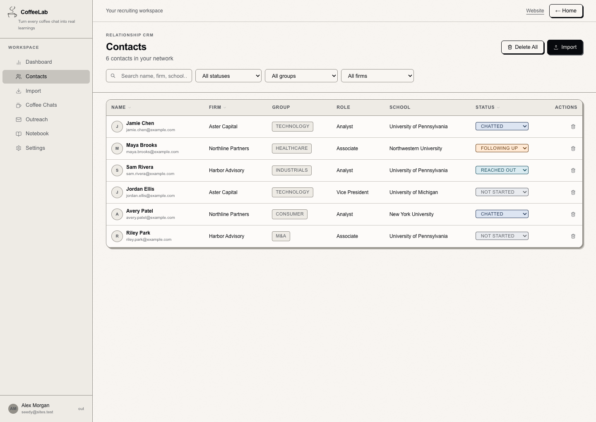
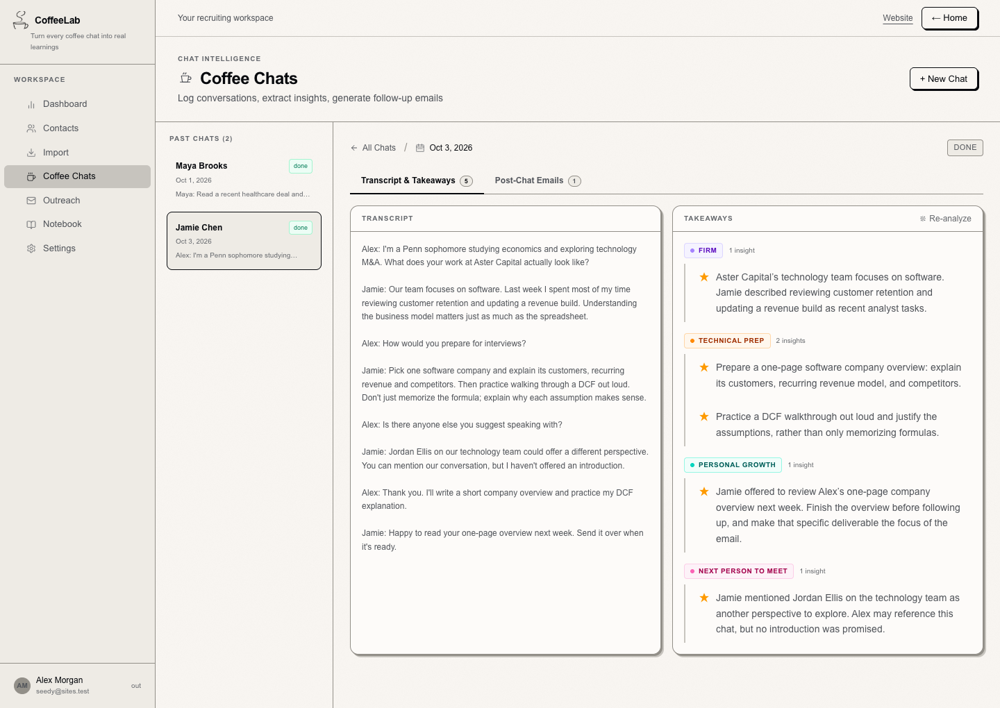
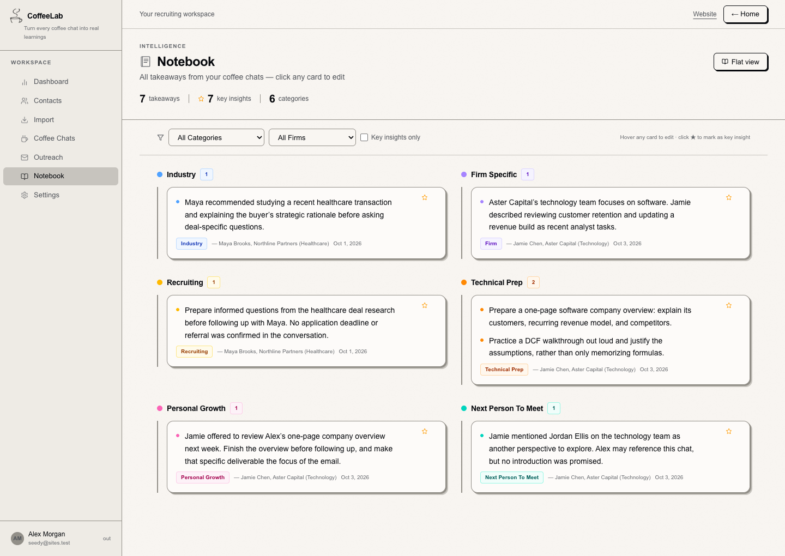
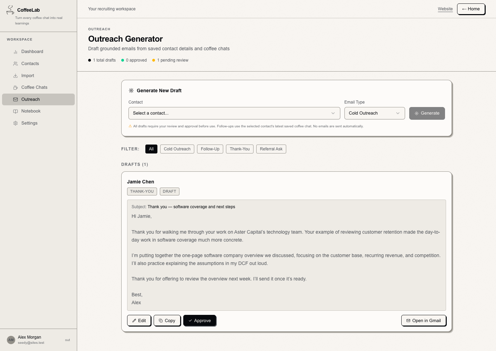
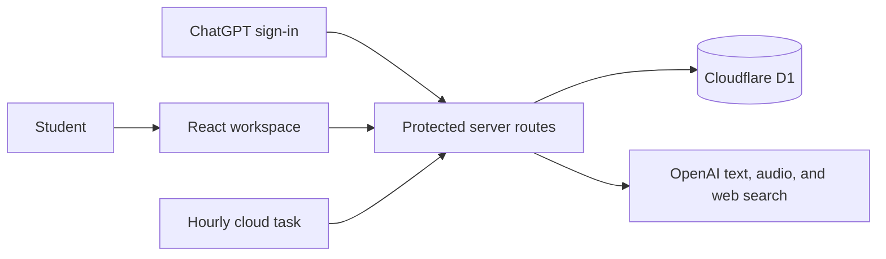

  

# CoffeeLab

**Remember the conversation. Make the next one better.**

A recruiting relationship workspace for students turning coffee chats into lasting professional connections. CoffeeLab brings contacts, conversation notes, useful takeaways, and thoughtful follow-ups into one place.

[Explore the product](https://coffeelab-recruiting.ryleelin.chatgpt.site/about) · [Open CoffeeLab](https://coffeelab-recruiting.ryleelin.chatgpt.site/) · [About the author](https://github.com/canihaveabagel)

> **Repository scope:** This public repository contains an earlier CoffeeLab prototype. The screenshots and product walkthrough below describe the current hosted application, which has evolved beyond this codebase. Its newer backend and deployment configuration are private; cloning this repository will not reproduce the live product.

Looking for the original prototype documentation? See [the archived prototype README](docs/prototype-setup.md).

## The problem

A good coffee chat leaves you with more than a name and an email address: a perspective on a team, a recruiting tip, an introduction, or a reason to follow up. Those details are easy to lose across spreadsheets, documents, and inboxes.

CoffeeLab keeps each conversation connected to the person and the student's goals, so the next message can begin with something specific.

## Product walkthrough

Start by saving your background and recruiting targets: school, major, graduation year, industry, firms, teams, region, and recruiting season. Those preferences guide relevant takeaways, outreach, and recruiting searches.

### 1. Build a network you can remember

Add contacts manually or import a CSV. Track outreach stages, professional details, notes, and conversation history in one place.

### 2. Capture the conversation

Log a chat against a contact using a pasted transcript, written notes, or a PDF, TXT, or Markdown document. Keep the source available alongside the analysis so you can revisit what was actually said.

### 3. Turn notes into a useful notebook

AI extracts individual takeaways into categories such as recruiting, technical preparation, firm insights, and people mentioned in a chat. Browse and filter across conversations, edit an insight, or mark it as especially useful.

### 4. Follow up with context

Draft cold outreach from your profile and contact details, or create follow-up, thank-you, and referral messages using a saved conversation. Review and edit the result before sending it yourself.

*All people, conversations, and messages shown in these screenshots are fictional demonstration data.*

The **recruiting radar** extends this workflow with relevant application pages, deadlines, and recent news. Each result includes a source link, matching explanation, evidence excerpt, and freshness information. An hourly cloud task rotates through eligible preference feeds; the interface shows each feed's actual last successful check.

## Design decisions

- **Make AI output reviewable.** Saved conversation text stays available, takeaways remain editable, and drafting instructions require supplied facts. A suggested introduction or referral signal needs explicit support in the source.
- **Connect memory to action.** Contacts, chats, takeaways, and drafts share context, reducing the work of reconstructing a conversation before writing a follow-up.
- **Keep the person in control.** CoffeeLab generates drafts; users decide what to send. It does not send emails automatically or scrape LinkedIn profiles.
- **Treat freshness as evidence.** Search discovery time is separate from publication time. An undated posting cannot become a “published within 24 hours” result simply because it was just found.
- **Make recruiting feel approachable.** A quiet paper-and-charcoal palette, hand-drawn coffee-cup identity, and notebook-inspired interface make a practical workflow feel personal. Typography uses an Aptos-first system font stack without redistributing unlicensed font files.

## Current hosted architecture

The live application uses React and TypeScript, Next.js routing through Vinext/Vite, tRPC, Cloudflare D1, and OpenAI. ChatGPT sign-in is provided through OpenAI Sites.

Protected routes scope records to the signed-in user. D1 persists profiles, contacts, saved transcript text, takeaways, drafts, and recruiting caches. Server-side usage limits bound AI requests. Failed analysis preserves previous takeaways, and failed recruiting refreshes preserve existing results.

These details describe the hosted application, not the architecture or setup requirements of the older prototype in this repository.

## Status and limitations

- Text analysis and email generation have been exercised successfully. Audio transcription is implemented, but activation still depends on available OpenAI API billing credits; it should not be treated as a currently verified live feature.
- When available, audio transcription requires permission to process the recording. CoffeeLab sends audio to OpenAI without storing the original recording. Saved transcript text is retained in the workspace, and OpenAI's processing and retention terms still apply.
- AI can miss or misinterpret details. Review extracted text, takeaways, names, dates, and drafts before relying on them.
- Recruiting radar is a discovery aid, not an exhaustive job board. Confirm eligibility, availability, and deadlines on the linked employer page. Hourly scheduling does not guarantee that every profile refreshes every hour.

## Author

Built by [canihaveabagel](https://github.com/canihaveabagel). CoffeeLab is a portfolio project exploring how product design and applied AI can help people maintain more thoughtful professional relationships.
