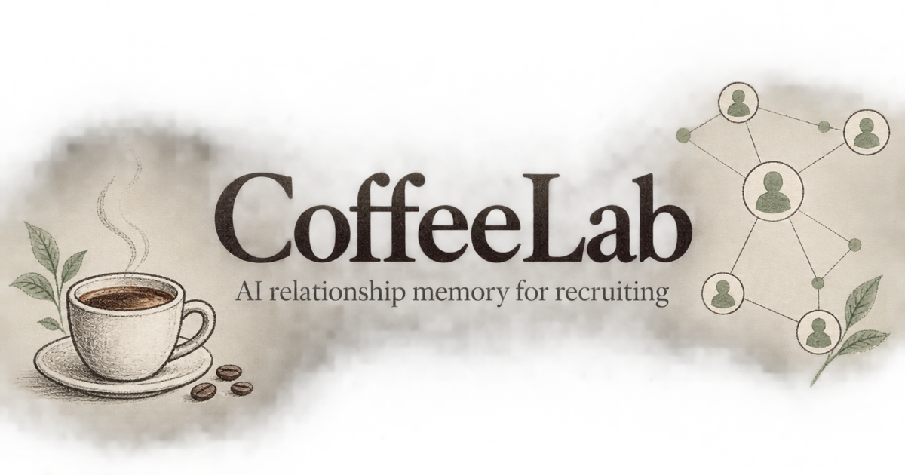

# CoffeeLab

**AI relationship memory for recruiting.** CoffeeLab is an open-source CRM for students who use coffee chats to build genuine professional relationships. It keeps contacts, conversations, recruiting deadlines, takeaways, and follow-ups in one focused workspace.



> CoffeeLab is currently optimized for investment-banking recruiting, but its contact and conversation workflow can be adapted for consulting, venture capital, and other relationship-driven searches.

## Why CoffeeLab

Recruiting information is usually scattered across spreadsheets, LinkedIn, calendar notes, transcripts, and half-finished email drafts. CoffeeLab turns that fragmented process into a repeatable loop:

1. Add or import the people you want to know.
2. Record a coffee chat from a transcript, notes, or a document.
3. Extract detailed, source-grounded takeaways with Claude.
4. Save the most important insights in a searchable notebook.
5. Draft a thoughtful thank-you, follow-up, or referral request.
6. Return to the dashboard for the next action and relevant recruiting timeline.

## Features

### Recruiting CRM

- Track contacts by firm, group, role, industry, school, status, and last-contact date.
- Search, filter, sort, edit, and remove contacts from a spreadsheet-style view.
- Import multiple contacts from CSV/TSV data with column mapping, or add them manually.
- Store useful relationship context such as hometown, clubs, shared school, LinkedIn URL, and notes.
- Keep each user's records isolated behind authenticated server procedures.

### Coffee-chat workspace

- Log a conversation against an existing contact.
- Paste a transcript, write notes, or upload a PDF, TXT, or Markdown document (up to 8 MB).
- Re-run analysis when the source changes.
- Review the original source beside the extracted insights.
- Generate post-chat thank-you and referral-request drafts from the conversation.

### AI takeaways

CoffeeLab uses the Anthropic Messages API to convert a conversation into structured, editable insights. The model is instructed to preserve uncertainty, avoid unsupported claims, and separate distinct ideas into individual bullets.

Takeaways are organized into:

- Industry
- Firm
- Group
- Recruiting
- Technical Prep
- Personal Growth
- Referral Signal
- Next Person to Meet

PDF and transcript extraction use Claude Haiku 4.5 for lower latency and cost. General drafting uses the configurable `ANTHROPIC_MODEL` value (Claude Sonnet 4.6 by default).

### Recruiting notebook

- Aggregate takeaways across every coffee chat.
- Filter by category, firm, or key-insight status.
- Switch between chronological and grouped views.
- Edit, copy, and star insights without changing the original transcript.
- See the exact number of insights, not just the number of chats.

### Outreach drafting

- Create cold-outreach and follow-up emails for a selected contact.
- Personalize drafts from shared school, hometown, club, firm, and group context.
- Edit and approve every draft before using it.
- Open the final draft in Gmail; CoffeeLab does not send email automatically.

### Personalized onboarding and dashboard

- Capture the user's name, school, major, class year, recruiting season, target firm/group, and recruiting region.
- Show CRM totals, follow-ups, completed chats, and recently contacted people.
- Surface region-specific recruiting milestones for the US, UK, Continental Europe, Hong Kong/APAC, or multiple regions.
- Link to live application trackers and guides from [The Trackr](https://the-trackr.com/).

### Experimental recommendations

CoffeeLab includes an early relationship-recommendation workflow that can prioritize untouched contacts, identify coverage gaps, and surface people mentioned during past chats. Treat this feature as experimental; the primary production workflow is the CRM, coffee-chat analysis, notebook, and outreach drafting.

## Tech stack

| Layer | Technology |
| --- | --- |
| Frontend | React 19, TypeScript, Tailwind CSS, Radix UI |
| Application runtime | Next.js-compatible Vinext on OpenAI Sites |
| API | tRPC, Zod, SuperJSON |
| Data | Cloudflare D1 (SQLite), Drizzle ORM |
| AI | Anthropic Messages API with structured JSON output |
| Hosting and auth | OpenAI Sites |

The browser talks to authenticated tRPC procedures. Those server procedures own all database access and Anthropic calls, so the API key never needs to be exposed to client-side JavaScript.

```text
React client
    │
    ├── authenticated tRPC procedures ── Cloudflare D1
    │
    └── server-only AI procedures ────── Anthropic Messages API
```

## Local development

### Prerequisites

- Node.js 22 or newer
- pnpm 10 or newer
- An Anthropic API key for AI features

### Setup

```bash
git clone https://github.com/canihaveabagel/coffeelab.git
cd coffeelab
pnpm install
cp .env.example .env.local
```

Set your own key in `.env.local`:

```dotenv
ANTHROPIC_API_KEY=your_anthropic_api_key
ANTHROPIC_MODEL=claude-sonnet-4-6
```

Then start the local app:

```bash
pnpm dev
```

The local server uses a preview identity for development. The database schema is created automatically against the configured `DB` D1 binding.

### Quality checks

```bash
pnpm check
pnpm test
pnpm build
```

## Deploying

This repository is configured for OpenAI Sites through `.openai/hosting.json` and expects a Cloudflare D1 binding named `DB`.

For a production deployment:

1. Create or select a Sites project with a D1 database binding named `DB`.
2. Add `ANTHROPIC_API_KEY` as an encrypted, server-only environment variable.
3. Optionally set `ANTHROPIC_MODEL` to another supported Anthropic model.
4. Run the checks above and deploy the exact tested commit.
5. Keep the deployment private until rate limits, abuse controls, and a privacy policy are in place.

Do not add `NEXT_PUBLIC_` to the Anthropic variable. That would expose the key to browsers.

## Cost and abuse controls

If you host CoffeeLab for other people, their document analyses and generated emails use **your** Anthropic account, tokens, and spending allowance. A public GitHub repository does not create this cost by itself; the cost belongs to whoever operates a deployed instance and supplies its API key.

Before opening a hosted deployment to the public:

- Create a dedicated Anthropic Workspace and key for CoffeeLab.
- Set a monthly Workspace spend limit and cost notifications.
- Add per-user quotas, request throttling, and file-frequency limits.
- Keep the existing server-side file type and size validation.
- Monitor usage by Workspace and API key.
- Rotate any key that has appeared in chat, screenshots, issues, or commits.

People who clone and self-host CoffeeLab should provide their own Anthropic key.

## Privacy and security

Coffee-chat transcripts can contain personal or confidential information. Uploaded content is processed by the configured Anthropic account and stored in the deployment's database as part of the user's workspace. Operators should obtain appropriate consent, publish a privacy policy, and define retention/deletion practices before offering the app publicly.

Never commit:

- `.env` or `.env.local`
- Anthropic API keys
- database credentials or service-role keys
- hosting, GitHub, or other access tokens

See [SECURITY.md](SECURITY.md) for the deployment checklist and vulnerability-reporting guidance.

## Project structure

```text
app/                 Next/Vinext routes and server entry points
client/src/pages/    CRM, chat, notebook, outreach, and settings screens
client/src/components/
drizzle/             D1 schema definitions
server/              tRPC routers, database access, and Anthropic adapter
shared/              Shared types and constants
public/              Public assets
```

## Contributing

Issues and pull requests are welcome. Please keep changes focused, avoid committing generated secrets or user data, and run `pnpm check`, `pnpm test`, and `pnpm build` before opening a pull request.

Good contribution areas include:

- stronger per-user rate limiting and spend controls
- transcript redaction and retention controls
- broader recruiting workflows beyond investment banking
- improved CSV import validation
- automated tests for tRPC procedures and document extraction
- accessibility and responsive-layout improvements

## Attribution

Recruiting timeline links point to public resources from [The Trackr](https://the-trackr.com/). CoffeeLab is not affiliated with or endorsed by The Trackr, Anthropic, OpenAI, or any firm referenced in user data.

## License

CoffeeLab is available under the [MIT License](LICENSE).
