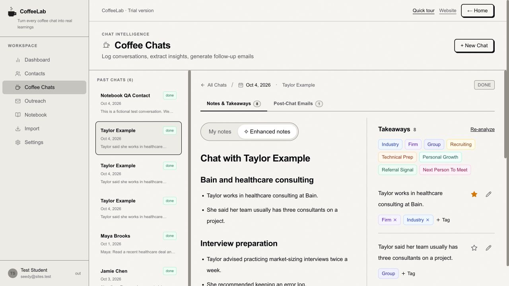
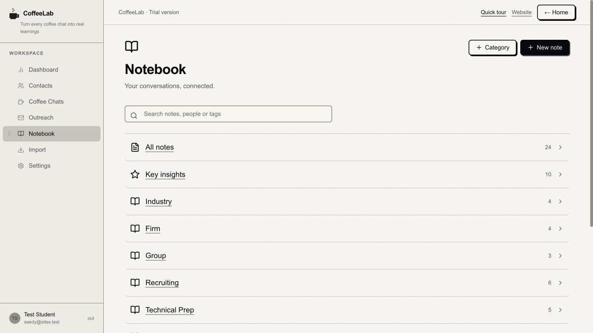
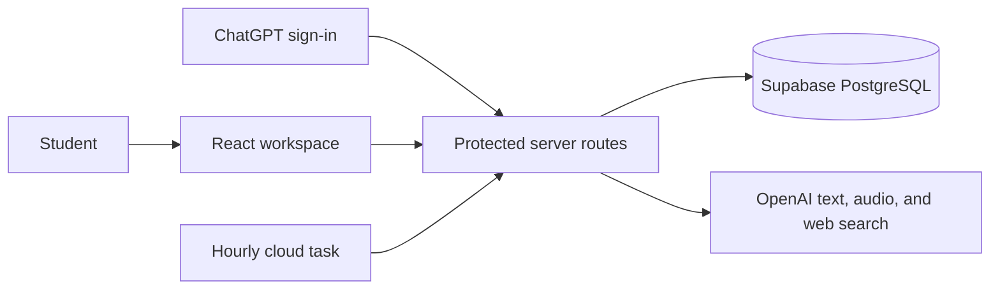

  

# CoffeeLab

**Remember the conversation. Make the next one better.**

A recruiting CRM for students turning coffee chats into lasting professional connections. CoffeeLab brings contacts, conversation notes, useful takeaways, and thoughtful follow-ups into one place. Today we focus on relationship management; the longer-term vision is a personalized job-search agent that connects your background, goals, opportunities, and network.

[Explore the product](https://coffeelab.space/about) · [Open CoffeeLab](https://coffeelab.space/) · [About the author](https://github.com/canihaveabagel)

**Live website:** [coffeelab.space](https://coffeelab.space/). Open it in your browser and select **Open workspace** to sign in. No installation or GitHub account is required to use the hosted product.

> **Repository scope:** This public repository contains an earlier CoffeeLab prototype. The screenshots and product walkthrough below describe the current hosted application, which has evolved beyond this codebase. Its newer backend and deployment configuration are private; cloning this repository will not reproduce the live product.

Looking for the original prototype documentation? See [the archived prototype README](docs/prototype-setup.md).

**Hosted release:** Version 24, published October 5, 2026, now available at **coffeelab.space**. This portfolio walkthrough reflects that release; the public prototype source is not a mirror of the production application.

## The problem

A good coffee chat leaves you with more than a name and an email address: a perspective on a team, a recruiting tip, an introduction, or a reason to follow up. Those details are easy to lose across spreadsheets, documents, and inboxes.

CoffeeLab keeps each conversation connected to the person and the student's goals, so the next message can begin with something specific.

## Product walkthrough

Start by saving your background and recruiting targets: school, major, graduation year, industry, firms, teams, region, and recruiting season. Those preferences guide relevant takeaways, outreach, and recruiting searches.

### 1. Build a network you can remember

Add contacts manually or import Excel, CSV, or TSV, including existing notes. Review detected columns before importing. New users receive a ten-step tour once after their first onboarding. Existing users are not automatically shown the tour. Completion is saved to the account, and anyone can replay it from the sidebar.

### 2. Capture the conversation

Upload audio, paste a transcript, write notes, or add a PDF, TXT, or Markdown document. Switch between **My notes** and **Enhanced notes** while reviewing concise, categorized takeaways alongside the summary. The source transcript stays folded away until you need it. CoffeeLab does not store original recordings.

### 3. Turn notes into a useful notebook

Browse a simple category index, preview pages, and open a topic to explore notes grouped by conversation. Create your own notes and categories, assign multiple color-coded tags, and star key insights. Tags use consistent colors across chats and the notebook, without hashtag prefixes. A point can belong to both Firm and Industry; each chat-derived insight links back to its source. Reanalysis preserves edited, tagged, and starred insights.

### 4. Follow up with context

Draft cold outreach from your profile and contact details, or create follow-up, thank-you, and referral messages using a saved conversation. Review and edit the result before sending it yourself.

*All people, conversations, and messages shown in these screenshots are fictional demonstration data.*

The **Open roles** feed focuses on recently verified vacancies in compact, expandable listings, without news or separate deadline tabs. An hourly cloud task rotates through preference feeds due for a daily check. Refreshes merge results instead of replacing the entire list; each retained role shows its own verification date. People mentioned in a conversation link back to that chat for context.

Discovery combines web search with selected employers' public job-board feeds, filtered using recruiting preferences. The feed shows up to 12 entries initially, with more available when matching results exist. It also links to Trackr for additional exploration; CoffeeLab does not scrape or mirror Trackr's database. The Product Analytics screen has been removed from the student workspace.

The public introduction page includes **Give us feedback** links in its header, closing call to action and footer, connected to the [CoffeeLab feedback form](https://docs.google.com/forms/d/e/1FAIpQLSeov5nUKCKmJNcDJuLOgWL4DSQgmwPb5I8cUgawfKurevO0lQ/viewform).

## Design decisions

- **Make AI output reviewable.** Saved conversation text stays available, takeaways remain editable, and drafting instructions require supplied facts. A suggested introduction or referral signal needs explicit support in the source.
- **Connect memory to action.** Contacts, chats, takeaways, and drafts share context, reducing the work of reconstructing a conversation before writing a follow-up.
- **Keep the person in control.** CoffeeLab generates drafts; users decide what to send. It does not send emails automatically or scrape LinkedIn profiles.
- **Treat freshness as evidence.** Discovery time is separate from publication time. A refreshed feed does not imply every retained posting was reverified. Follow the source before applying.
- **Make recruiting feel approachable.** A quiet paper-and-charcoal palette, minimal pixel-cup identity, and notebook-inspired interface make a practical workflow feel personal. Typography uses an Aptos-first system font stack without redistributing unlicensed font files.

## Current hosted architecture

The live application uses React and TypeScript, Next.js routing through Vinext/Vite, tRPC, Supabase PostgreSQL, and OpenAI. ChatGPT sign-in is provided through OpenAI Sites.

Protected routes scope records to the signed-in user. Database access is server-only; application tables have row-level security enabled and deny direct access to public/client keys. Supabase persists profiles, contacts, saved transcript text, takeaways, drafts, and recruiting caches. Transactional server-side usage limits bound AI requests. The migration preserves existing accounts, conversations and notes without changing the ChatGPT sign-in flow. Failed analysis preserves previous takeaways, and failed recruiting refreshes preserve existing results.

ChatGPT sign-in identifies the user; it does not supply the user's API balance. AI processing uses the deployment operator's server-side OpenAI credentials. Application limits count requests, rather than guaranteeing a fixed dollar budget. API keys, production user records, and private deployment configuration are not published in this repository.

These details describe the hosted application, not the architecture or setup requirements of the older prototype in this repository.

## Status and limitations

- CoffeeLab is an early-access trial. Audio transcription, summaries, and email generation have passed real API tests using fictional test material; file-size and usage limits apply.
- Audio transcription requires permission to process the recording. CoffeeLab sends audio to OpenAI without storing the original recording. Saved transcript text is retained in the workspace, and OpenAI's processing and retention terms still apply.
- AI can miss or misinterpret details. Review extracted text, takeaways, names, dates, and drafts before relying on them.
- Open roles is a discovery aid, not an exhaustive job board. Confirm eligibility, availability, and deadlines on the linked employer page. Daily checks can be delayed by provider failures or shared usage limits when many distinct profiles need updates.

## Where CoffeeLab is going

**CRM first. Personalized job-search assistance next.**

Our current priority is a dependable place to manage relationships, capture conversations, organize what you learn, and follow up thoughtfully.

Planned directions include:

- Better matching between your background, goals, and recruiting opportunities.
- Resume-informed suggestions for relevant people and next steps, with clear reasons.
- More personalized follow-up drafts grounded in actual conversations.
- Larger audio uploads, speaker identification, and expanded storage.
- More proactive help across the job-search process, while keeping you in control of outreach.

These are product directions, not currently available agent features. Premium plans are planned as the product develops; the trial does not enroll users in a subscription.

## Author

Built by [canihaveabagel](https://github.com/canihaveabagel). CoffeeLab is a portfolio project exploring how product design and applied AI can help people maintain more thoughtful professional relationships.
